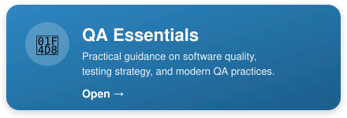
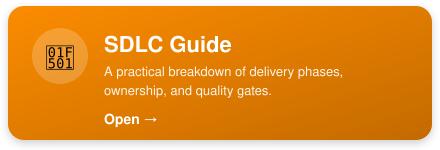

🚀 Building reliable systems, scaling quality, and turning complex delivery into clear execution.

  
  
  

---

## 👩🏾‍💻 About Me

I work at the intersection of **technical program management, quality engineering, and AI-enabled delivery**.

I specialize in turning ambiguity into structured execution through:

* 🧭 Technical program & release management
* 🧪 QA strategy, automation & release governance
* 🤖 Agentic AI workflows & AI reliability
* ⚙️ CI/CD, GitHub Actions & delivery automation
* ☁️ AWS & infrastructure-aware testing
* 📝 Technical documentation & process design

### 🚦 How I ship

  

---

## 🛠️ Tech & Tools

  

**Delivery:** Agile · Scrum · Kanban · SDLC · Release Management · Risk Management
**Testing:** Playwright · WebdriverIO · Appium · BrowserStack · ContextQA · API Testing
**Engineering:** JavaScript · TypeScript · React · Next.js · GitHub Actions
**Cloud:** AWS · CloudWatch · IAM · SNS · SQS
**AI:** ChatGPT · Cursor · Google ADK · LLM Evaluation · Prompt Engineering

---

## 🔥 GitHub Activity

---

## 📚 Featured Work

### 📘 QA Essentials

Practical guidance on software quality, testing strategy, and modern QA practices.
🔗 https://jkaweesi22.github.io/QAEssentials/#/

### 🔁 SDLC Guide

A practical breakdown of software delivery phases, ownership, and quality gates.
🔗 https://jkaweesi22.github.io/SDLC/

---

## 🌱 What I Value

**Reliable delivery · Clear ownership · Strong documentation · Servant leadership · Purpose-driven technology**

---

## 📫 Connect

💼 LinkedIn: https://www.linkedin.com/in/jackie-namanda-75912a81/
🌐 Portfolio: https://jkaweesi22.github.io/Kaweesi-Resume/
📓 Field Log (private): https://claude.ai/artifact/XYxmMmaHBQQLJMMEjypzEX

---

### *“Strong systems are built twice: once in design, and once in execution.”*

